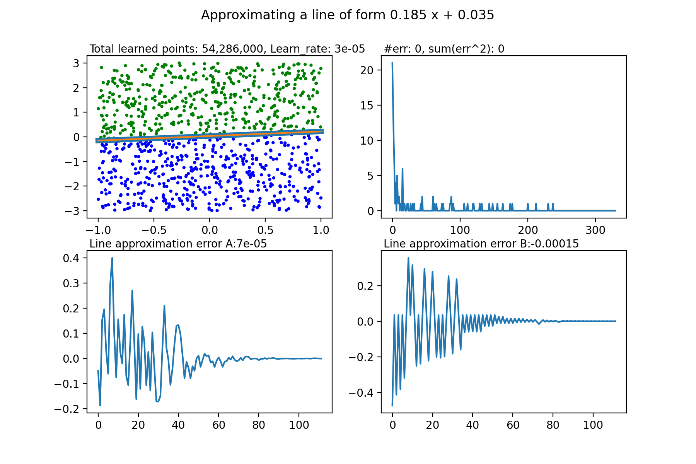

# Single Neuron Neural Network - Perceptron

This program creates a single neuron neural network tuned to guess if a point is above or below a randomly generated line and generates a visualization based on graphs to see how the neural network is learning through time.

The neuron is called Perceptron and has 3 inputs and weights to calculate its output:
    
    input 1 is the X coordinate of the point,
    Input 2 is the y coordinate of the point,
    Input 3 is the bias and it is always 1

    Input 3 or the bias is required for lines that do not cross the origin (0,0)

The Perceptron starts with weights all set to zero and learns using 1,000 random points per each iteration.

The output of the perceptron is calculated based on stochastic gradient descent as follows:
    if x * weight_x + y weight_y + weight_bias is positive then 1 else 0

The error for each point is calculated as the expected outcome of the perceptron minus the real outcome therefore there are only 3 possible error values:

    Expected    Calculated  Error
    1           -1          1
    1           1           0
    -1          -1          0
    -1          1           -1

With every point that is learned if the error is not 0 the weights are adjusted according to:

    New_weight = Old_weight + error * input * learning_rate
    for example: New_weight_x = Old_weight_x + error * x * learning rate

The learning_rate decreases with every iteration as follows:

    learning_rate = 0.01 / (iteration + 1)

this is important to ensure that once the weights are nearing the optimal values the adjustment in each iteration is subsequently more subtle.
